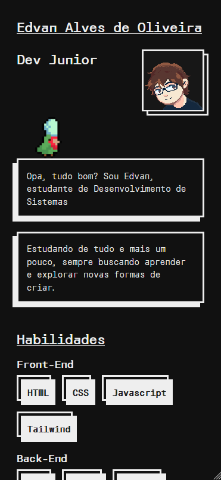
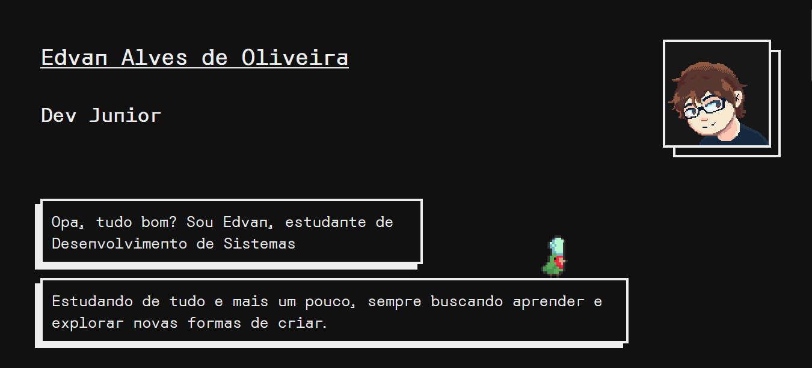

# Portfolio

Projeto de portfólio pessoal de apresentação

## Visão Geral

Este projeto consiste em um site de portfólio pessoal criado para apresentar minhas habilidades, projetos, experiência e contato de forma clara e visual, desenvolvido como prática de execução planejamento de projetos e criação de TAP (Termo de Abertura de Projeto) na disciplina Projetos de Software do curso técnico em Desenvolvimento de Sistemas do Senai
Ele foi desenvolvido para servir como meu cartão de visitas digital, sendo responsivo e estilizado com HTML + CSS.

## Design e Estilo Visual
O portfólio foi desenvolvido seguindo a abordagem **Mobile First**, garantindo que a experiência em dispositivos móveis seja priorizada desde o início do desenvolvimento.  
A estrutura e os estilos foram planejados para telas pequenas primeiro e depois adaptados para telas maiores, assegurando um layout responsivo e consistente em qualquer dispositivo.

Além disso, produzi alguns sprites em **pixel art** para este projeto (O auto-retrato e o papagaio).  
Essas artes foram criadas para dar uma identidade única ao portfólio, trazendo um toque retrô e pessoal ao design, em harmonia com a proposta minimalista e moderna da interface.

## Tecnologias Utilizadas

* HTML5
* CSS3
* [Figma](https://www.figma.com/design/wbuf6aWAJp3E7b26L6twZC/Portfolio-Prot%C3%B3tipo?node-id=1-2&t=aYulIFV9zxEpjw7F-1)

## Funcionalidades Principais

* Apresentação pessoal (quem sou)
* Seção de projetos com links / imagens
* Seção de habilidades / tecnologias
* Formulário ou link de contato
* Navegação simples e fluida
* Layout responsivo que adapta em diferentes larguras de tela

## Screenshots

### Tela Inicial (Celular)

### Tela Inicial (Desktop)

## Acesso da Página:
O portfólio está disponível online através do GitHub Pages.  
Acesse pelo link abaixo:

[Acesse o projeto online](edvanoalves.github.io/Portfolio/)

## Autor
[Edvan Alves](https://www.linkedin.com/in/edvan-alves/)